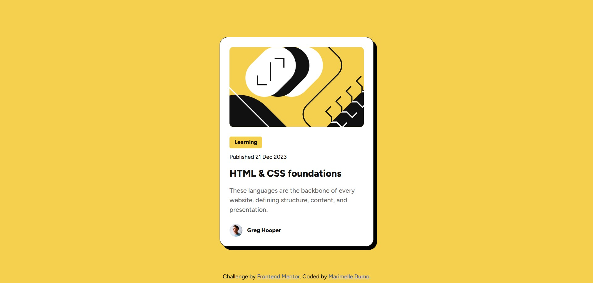

# Frontend Mentor - Blog preview card solution

This is a solution to the [Blog preview card challenge on Frontend Mentor](https://www.frontendmentor.io/challenges/blog-preview-card-ckPaj01IcS). Frontend Mentor challenges help you improve your coding skills by building realistic projects. 

## Table of contents

- [Overview](#overview)

  - [The challenge](#the-challenge)
  - [Screenshot](#screenshot)
  - [Links](#links)

- [My process](#my-process)

  - [Built with](#built-with)
  - [What I learned](#what-i-learned)
  
- [Author](#author)

## Overview

### The challenge

Users should be able to:

- See hover and focus states for all interactive elements on the page

### Screenshot

### Links

- Solution URL: [https://github.com/Marimelle/blog-preview-card](https://github.com/Marimelle/blog-preview-card)

- Live Site URL: [https://marimelle.github.io/blog-preview-card/](https://marimelle.github.io/blog-preview-card/)

## My process

### Built with

- Semantic HTML5 markup

- CSS variables for color, spacing and font

- Flexbox for layout

### What I learned

1. **Semantic HTML Structure**

    Used `<main> ` for the primary content and `<footer>` for the attribution text

    Wrapped the card in `<article>` for better semantics.

    Implemented proper heading hierarchy (`<h1>` for the title, `
` for text).

    Added descriptive `alt` text to images for accessibility.

2. **CSS Techniques**

    Flexbox: Centered the card using flexbox and `margin: auto`

    Interactivity: Created hover effects for the blog title (color change and cursor pointer).

3. **Design Implementation**

    Matched the design’s colors, spacing, and borders from the Figma design file.

    Used `border-radius` for rounded corners and `box-shadow` for depth.

4. **Debugging Wins**

    Fixed image overflow by adding `overflow: hidden` to the parent container.

    Resolved spacing issues with `margin` and `padding` adjustments.

5. **Accessibility**

    Ensured all images have meaningful `alt` attributes.

## Author

- Github - [Marimelle Dumo](https://github.com/Marimelle)
- Frontend Mentor - [@Marimelle](https://www.frontendmentor.io/profile/Marimelle)

